# Welcome to my programming portfolio

## Table of contents

1.  [Introduction](#Introduction)
2.  [University](#Uni)
    1. [First Year](#FirstYear)
        1. [PHP and SQL Website Project](#PHPSQL)
        2. [ARM assembly](#ARM)
        3. [Programming in HDL](#HDL)
        4. [C programming basics](#CBasics)
        5. [Low level Server programming in C with djikstras](#CServer)
        6. [Haskell basics](#Haskell)
        7. [Learning Java basics and making reversi in Java](#ReversiJava)
    2. [Second Year](#SecondYear)
        1. [C++ game using SDL2](#CPPSDL2)
        2. [Snake game using JavaFX and making it maintainable](#JFX)
        3. [Capital one smart receipt analyser app (group work)](#GRP)
        4. [Operating system process scheduler using POSIX threads ](#OPPSX)
    3. [Third Year](#ThirdYear)
        1. [Implementing AES in Galois counter mode This project focused on implementing AES in GCM](#AESGCM)
        2. [Visualising information via the observable javascript framework](#VIZ)
        3. [OpenGL programming in C++](#OpenGL)
            1. [Project 1](#OpenGL1)
            2. [Project 2](#OpenGL2)
            3. [Project 3](#OpenGL3)
        4. [Making an AI chatbot in Python using only NLTK](#ChatBot)
        5. [Creating phone apps in android](#MobileApp)
            1. [Project 1](#App1)
            2. [Project 2](#App2)
3. [Own Projects](#Own)
    1. [PadPointMouse](#PadPointMouse)
    2. [Pic2SpreadSheet](#Pic2SpreadSheet)
    3. [TwitX](#TwitX)
    4. [YTS](#YTS)
    5. [Garys Shop](#GarysShop)
    6. [Steam Game Comparitor](#SteamGameComparitor)
    7. [Job Finder API](#JobFinderAPI)
    8. [Battery Viewer](#BatteryViewer)
    9. [Cain's Voyage](#CainsVoyage)
    10. [Terminar](#Terminar)
    11. [ImageToAscii](#ImageToAscii)
    12. [CMD_CLOCK](#CMDCLOCK)

## Introduction 

This portfolio will showcase my projects I have done throughout my time at The University Of Nottingham. Some modules will be left out due to them being mostly if not ***all*** theoretical. I will NOT be using the module names and module code numbers for this repo. I am doing this to stop any new students finding answers and/or solutions to problems in content that may still be used within the university. If you are one of these students, turn back now, you ***WILL*** be caught for plaigarism. A lot of first year is a hazy memory to me, as I am writing this, it was ***two*** years ago. So a lot of content regarding first year is going to be incomplete and may even be somewhat innacurate since I may mistake a module for another or misrepresent some information as another. But rest assured, the subsequent years are within my full recollection. The first year was ungraded and is more here to show my progression throughout my degree. 

## [University](https://www.nottingham.ac.uk/) 

## First year

### [PHP and SQL Website Project](https://github.com/Barnold8/PHP-and-SQL-Website-Project/tree/main) 

This project involved creating a dynamic website using PHP to interface with an SQL database. The website I crafted for this module demonstrates the functionality of a mock movie database, showcasing the ability to store and retrieve movie information. To enhance security and prevent SQL injection attacks, JavaScript is used to sanitize inputs on the frontend. For a demonstration of the website, check out [this video](https://www.youtube.com/watch?v=WZ4swjO1exw).

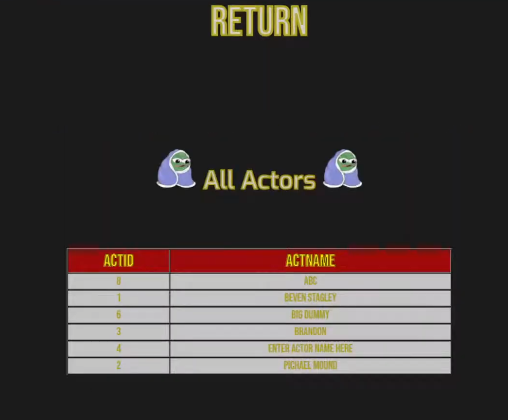

### [ARM assembly](https://github.com/Barnold8/ARM-Module) 

This project involved writing programs in ARM assembly that ran using the [Komodo](https://studentnet.cs.manchester.ac.uk/resources/software/komodo/manual.html) emulator. This included mini projects like FizzBuzz to things like the printf function from [C](https://en.wikipedia.org/wiki/C_(programming_language)). These programs were written in ARM that ran in the Komodo emulator (it's not very good).

### [Programming in HDL](https://github.com/Barnold8/HDL-Module-) 

This project took me down the [nand2tetris](https://www.nand2tetris.org/) route of learning HDL code to write everything from [adders](https://en.wikipedia.org/wiki/Adder_(electronics)) to an [ALU](https://en.wikipedia.org/wiki/Arithmetic_logic_unit#:~:text=In%20computing%2C%20an%20arithmetic%20logic,operates%20on%20floating%20point%20numbers.)

### [C programming basics](https://github.com/Barnold8/C-programming-module) 

 

This project involved writing C code. In university this was one of the first modules we undertook. It was more of a "this is how to program for beginners" than it was anything else. However later down the line we did learn more advanced concepts and of course, because it is C, it included manually managing memory. 

### [Low level Server programming in C with djikstras](https://en.wikipedia.org/wiki/HTTP_404) 

This project took everything we knew from C and algorithms and took me through the process of making a lightweight server in C that uses djikstras algorithm to find the shortest path for server communications. It was all a theoretical environment, we didn't actually connect to any server over a network, it was just making a server and client program that ran on the same machine but we made it in C. 

### [Haskell basics](https://en.wikipedia.org/wiki/HTTP_404) 

This project taught me the fundamentals of functional programming using haskell. Each file in the repository is from a different coursework I had to do. While I don't remember the exact details of what I had to do in these courseworks, this does showcase my ability to learn new concepts and languages with ease. 

### [Learning Java basics and making reversi in Java](https://en.wikipedia.org/wiki/HTTP_404) 

This project taught me about the fundamentals of Java and OOP programming in general. At the end of this module I had to make reversi in Java using the [Swing](https://docs.oracle.com/javase/tutorial/uiswing/) GUI framework. 

## Second Year 

### [C++ game using SDL2](https://en.wikipedia.org/wiki/HTTP_404) 

This project was making a game in SDL2 with a predefined library made by my professor. This library handled SDL2 on an abstract basis hiding a lot of the raw functionality of SDL2 in an attempt to make it easier (it made it harder). My game takes heavy inspiration from [The Binding of Isaac](https://store.steampowered.com/app/250900/The_Binding_of_Isaac_Rebirth/). I had to code the collision detection and AI pathing. Collision was as simple as box to box collisions or circle to circle collisions. All of the rendering techniques had to be done by hand bar the basics boilerplate stuff in SDL2 that was abstracted by my professor. A video for this project can be found [here](https://www.youtube.com/watch?v=VMRoGM5__q8) (technical overview) and [here](https://www.youtube.com/watch?v=x6BJbzGrij0) (game trailer).

#### Example Image

> 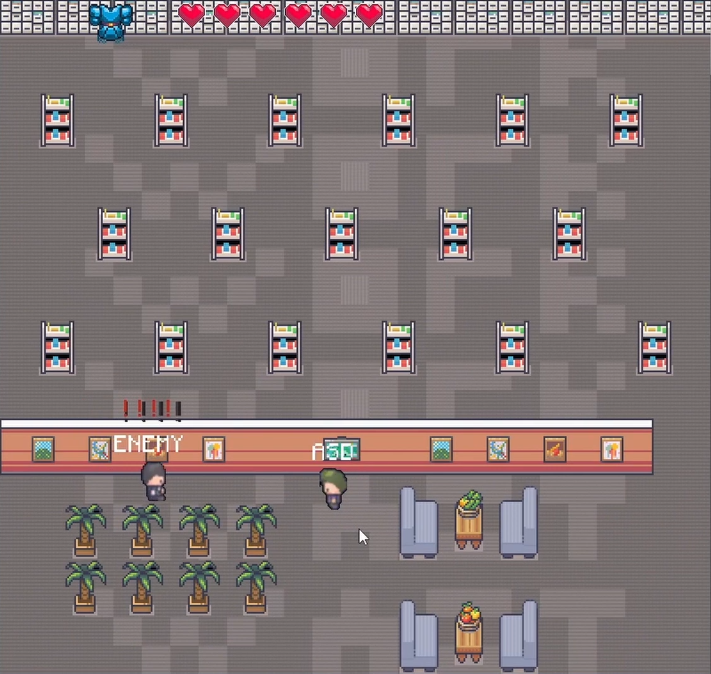

### [Snake game using JavaFX and making it maintainable](https://en.wikipedia.org/wiki/HTTP_404) 

This module focused on making software maintainable and fixing code that was objectively bad and/or incomplete. The ending result is a game of [Snake](https://en.wikipedia.org/wiki/Snake_(video_game_genre)) using Java and the [JavaFX](https://openjfx.io/) GUI framework. The original GUI framework for this was [Swing](https://docs.oracle.com/javase/tutorial/uiswing/) but I ported it over to [JavaFX](https://openjfx.io/). To be transparent, the change between frameworks is because swing is deprecated and cannot be maintained any longer. Anything new could conflict with old libraries of swing and security risks are bound to appear making it silly to keep swing as the framework of choice. 

#### Example Images
> 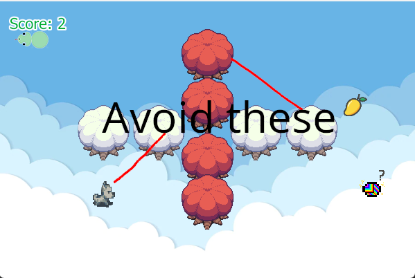
> 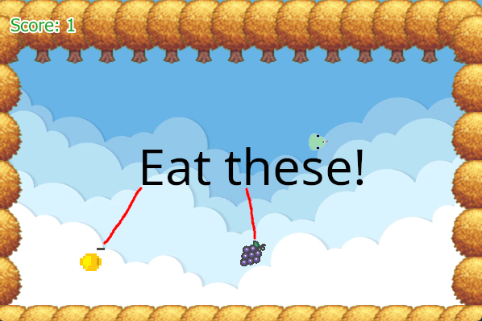

### [Capital one smart receipt analyser app (group work)](https://en.wikipedia.org/wiki/HTTP_404) 

This module centered on group work and included a singular assignment sourced from Capital One. Our group consisted of seven members, although only four were consistently active throughout the majority of the project. The project involved developing a smart receipt analyzer—a phone application that performs OCR on receipts, sends the extracted information to an API, and uses categorization techniques to accurately categorize items. It then performs statistical analysis on the receipts to help users better manage their budgets. The results of the statistical analysis were presented to users through [information visualization](https://en.wikipedia.org/wiki/Data_and_information_visualization) and interactive components.

We managed this project using sprints and conducted team meetings after every two sprints. Every other meeting included the same assigned Capital One employee each time to discuss progress and ask questions in regards to what is expected of the software. Each member had specific roles.

My specific contributions included:
- Creating a RESTful API in Python using Flask.
- Developing and maintaining an SQL database.
- Facilitating interactions between the AI and the database through API calls.
- Preserving app sessions via session tokens (establishing a many-to-one relationship).
- Managing user accounts.
- Handling communications between frontend and backend components via the API.
- Initially creating the Docker container and subsequently upgrading it to Docker Compose to support multiple containers.
- Co-maintaining the Docker configuration with a group member to ensure stability and utility. 

The project achieved a categorization success rate of 85%, utilizing techniques such as [fuzzy matching](https://winpure.com/fuzzy-matching-guide/), [NLP](https://en.wikipedia.org/wiki/Natural_language_processing), and [Bayes' theorem](https://en.wikipedia.org/wiki/Bayes%27_theorem). Essentially, we developed an AI that categorizes items with a high success rate, all running on a phone.

At the end of this project we both showcased our application to the University during an Open-Day and also to the members at Capital One in their building in Nottingham. Both parties were delighted with the amount of work achieved and the quality of said work!

#### Example Images
> 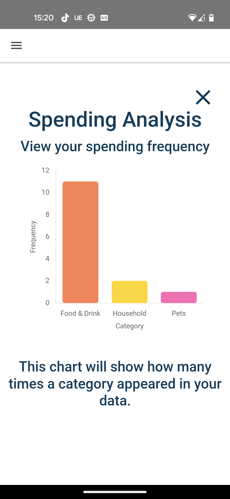
> 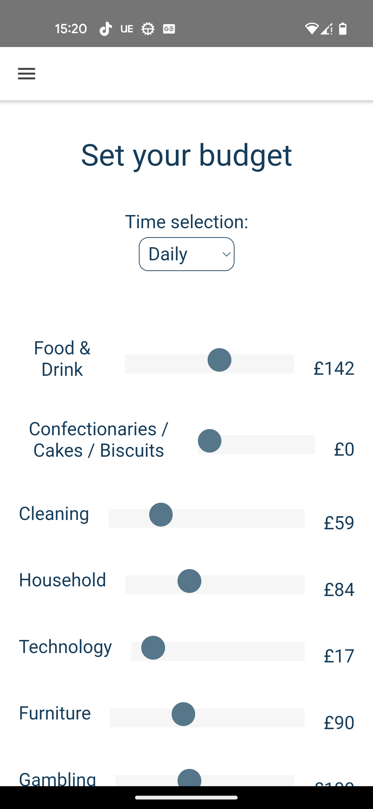
> 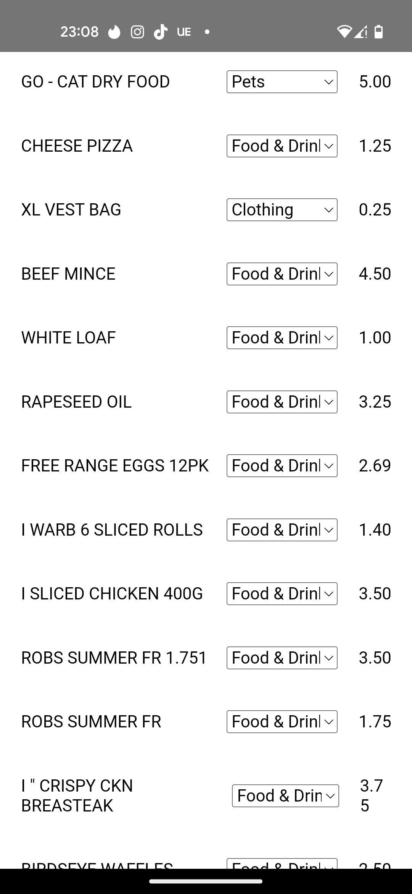
> 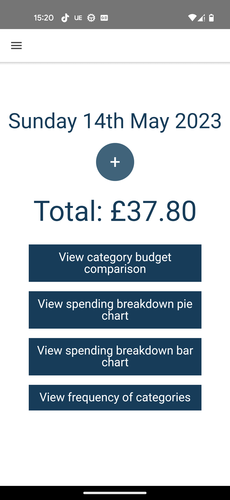
> 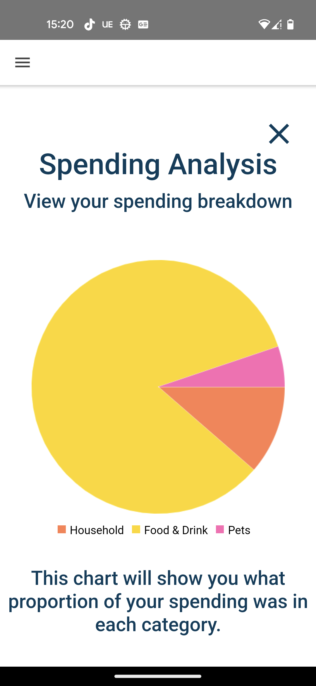
> 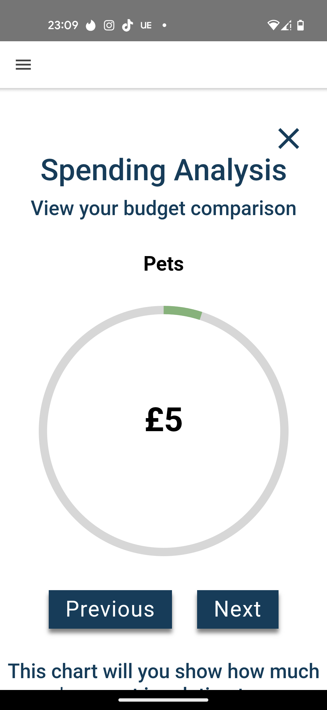

### [Operating system process scheduler using POSIX threads](https://en.wikipedia.org/wiki/HTTP_404) 

This module provided an in-depth understanding of operating systems, covering topics such as paging memory, process management, queues, concurrency, disk I/O methodologies, forks, and PIDs. Our project involved simulating a process scheduler in C. The process scheduler was required to queue processes based on priority while simulating I/O operations. This added complexity because I/O operations typically take longer than regular CPU processes. To achieve this, we incorporated process tables, queues, and a disk scheduling algorithm. 

## Third Year 

### [Implementing AES in Galois counter mode](https://en.wikipedia.org/wiki/HTTP_404) 

This project focused on implementing [AES](https://en.wikipedia.org/wiki/Advanced_Encryption_Standard) in [GCM](https://en.wikipedia.org/wiki/Galois/Counter_Mode). I was given a set of code tests (I think they were Junit?) to pass to ensure the correct implementation of AES in GCM.

### [Visualising information via the observable javascript framework](https://en.wikipedia.org/wiki/HTTP_404) 

This project was to take a topic of my choosing and ask questions on said topic. My topic revolved around mental health in England. I ask questions like "How much do finances contribute to depression" and "What parts of England on average are more depressed?". I go over these questions gathering data from various sources, (everything is explained and referenced properly in the coursework), and I then clean the data if needed, ensure its fit for its use and then perform a data visualisation on it to answer the question. I go over how I clean, transform and fit the data for all instances that I use data, which is very often and I also reflect on the results that transpire from the visualisations. 

This project can be seen [here](https://observablehq.com/d/bd50049bcdde6885) but the git repo is there for the event that the link is no longer available. 

#### Example Images
> 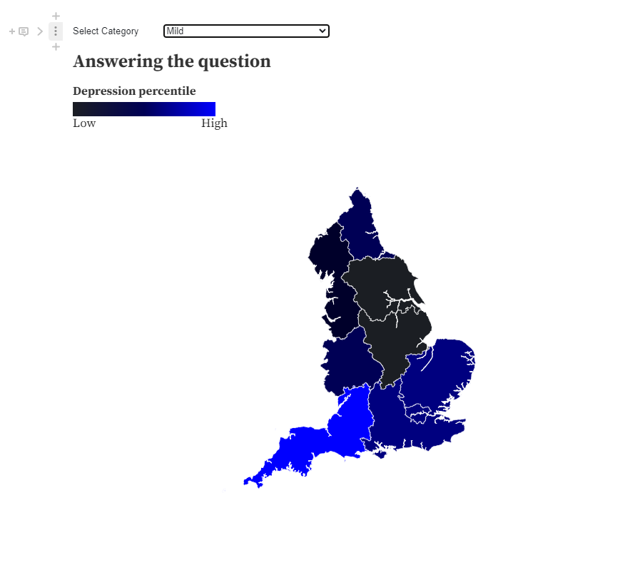
> 

### [OpenGL programming in C++](https://en.wikipedia.org/wiki/HTTP_404) 

This module was 3 whole projects in [C++](https://en.wikipedia.org/wiki/C%2B%2B) with [GLFW](https://www.glfw.org/) and [openGL](https://opengl.org/). The first project is [SDL2](https://www.libsdl.org/c) but thats abstracted away by my professor since it is not needed to be known to achieve the marks for the coursework.

#### **Project 1**  

Software render a triangle in [SDL2](https://www.libsdl.org/c) using rasterising techniques we learned during the module like [Barycentric coordinates](https://en.wikipedia.org/wiki/Barycentric_coordinate_system) and [antialisasing](https://en.wikipedia.org/wiki/Anti-aliasing) via [multi sampling](https://en.wikipedia.org/wiki/Multisample_anti-aliasing). 

#### Example Image
> 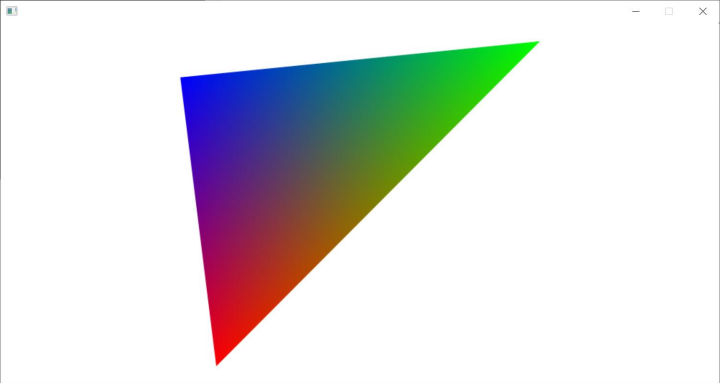

#### **Project 2** 

Make an OBJ parser and load an OBJ into memory and render it using [openGL](https://opengl.org/). While this sounds simple on paper, it can be quite complex if you don't know [openGL](https://opengl.org/) and haven't ever made an OBJ parser. 

#### Example Image
> 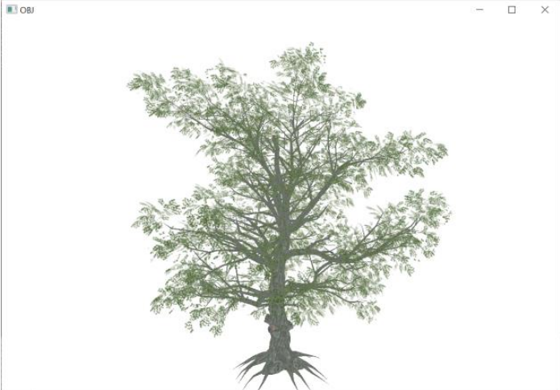

#### **Project 3** 

This was to create a graphics scene of my choosing, it was that open ended which was brilliant. I decided to go for a somewhat PS2 style scene with a heavy influence on the Silent Hill games. This required that I do texturing, lighting, procedural generation, shadows to get the main marks. However there was an R&D section in which I chose to do the following:

- [Linear Fog](https://youtu.be/oQksg57qsRA?t=224)
- [Text rendering](https://learnopengl.com/In-Practice/Text-Rendering)
- Dynamic light arrays [arrays in GLSL](https://www.khronos.org/opengl/wiki/Data_Type_(GLSL)#Arrays)
- [Procedural terrain](https://en.wikipedia.org/wiki/Procedural_generation) generation using a [noise map](https://en.wikipedia.org/wiki/Perlin_noise)
- [Skybox](https://en.wikipedia.org/wiki/Skybox) using a [cubemap](https://en.wikipedia.org/wiki/Cube_mapping) 
- [FPS cap](https://en.wikipedia.org/wiki/Frame_rate)
- [Dynamic shadows](https://en.wikipedia.org/wiki/Shadow_mapping)
- Camera animation track with [Bezier curves](https://en.wikipedia.org/wiki/B%C3%A9zier_curve)

#### Example Images
> 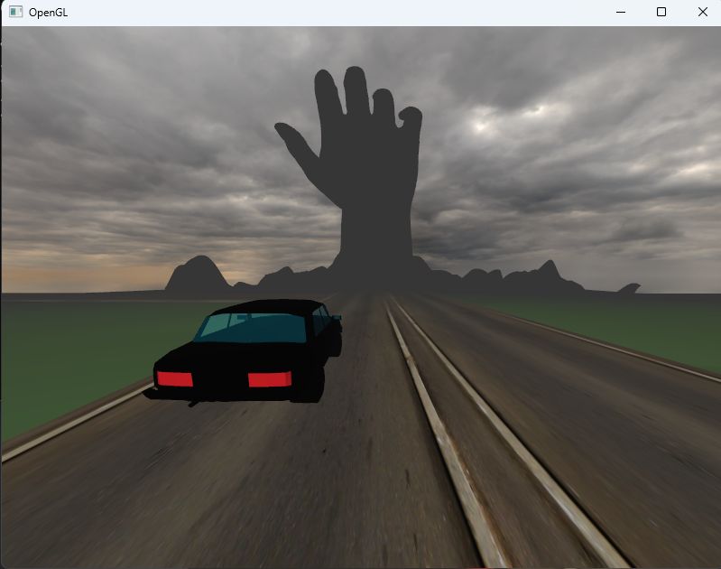
> 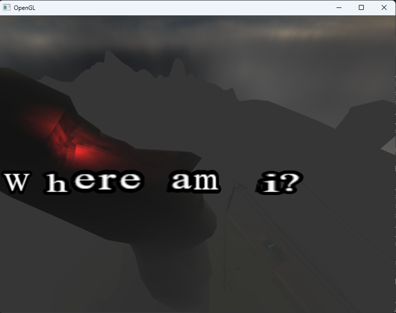

### [Making an AI chatbot in Python using only NLTK](https://en.wikipedia.org/wiki/HTTP_404) 

This project was to make an AI chatbot in python using principles in natural language processing. My version of this coursework was a playlist manager via a chatbot interface. The chatbot handled things like small talk, trivia and of course, playlist management. The way I achieved this with no external libraries except for [NLTK]https://www.nltk.org/ was to use classifiers. In AI based systems, a classifier can be taught, or used outright to classify information using mathematical probability. In my AI chatbot, I used the [Naive Bayes Classifer](https://en.wikipedia.org/wiki/Naive_Bayes_classifier) to match specific actions, attributes and sentiments to predefined outputs. For example, sentences like "I would like to make a playlist", "make a playlist" and "want a playlist" would activate the playlist classification" because they hold the closest probability to being a match with the predefined outputs that relate to making a playlist. I also used [Sentiment Analysis](https://en.wikipedia.org/wiki/Sentiment_analysis) to determine if the outcome of the AI met the users needs based on their response. This was also used to determine if the user wanted or didn't want to do something. For example, "I don't want to make a playlist" would match the playlist classification but it would not do anything because the sentiment is negative. 

### [Creating phone apps in android](https://en.wikipedia.org/wiki/HTTP_404) 

This module had two projects within it. 

- **Project 1** 

    - An MP3 player
        - Picking songs
        - Loading songs
        - Change playback speed
        - Colour configuration
        - [Background services](https://developer.android.com/develop/background-work/services)
        - [MVC](https://en.wikipedia.org/wiki/Model%E2%80%93view%E2%80%93controller#)
        - Appropriate permission management

#### Example Image
> 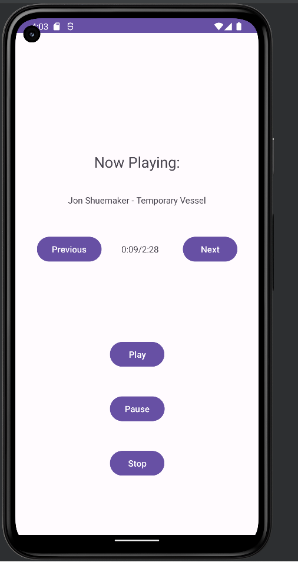
 

- **Project 2** 

    - Geotracking application
        - Track travelled paths when user specifies to do so
            - Choose type of path [Walking, running, cycling]
        - [DAO](https://developer.android.com/training/data-storage/room/accessing-data)
        - Exposing database so other apps can read information but not write
        - Set reminders that trigger in geofenced areas
        - [MVC](https://en.wikipedia.org/wiki/Model%E2%80%93view%E2%80%93controller#)
        - Save data
        - Statistical analysis of exercises
        - Inspect geofences
        - Proper use of android life cycles
        - Communication between components using serialsiable data structures
        - Proper use of activities and intents (intents were used primarily to switch between activities and also send serialisable data)
        - [Background services](https://developer.android.com/develop/background-work/services)
        - Google maps interfacing to allow for interactable geofencing placements and to visualise paths taken while recording activities
        - Appropriate permission management

#### Example Images
> 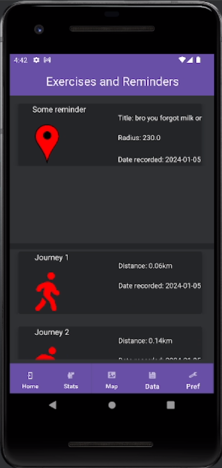
> 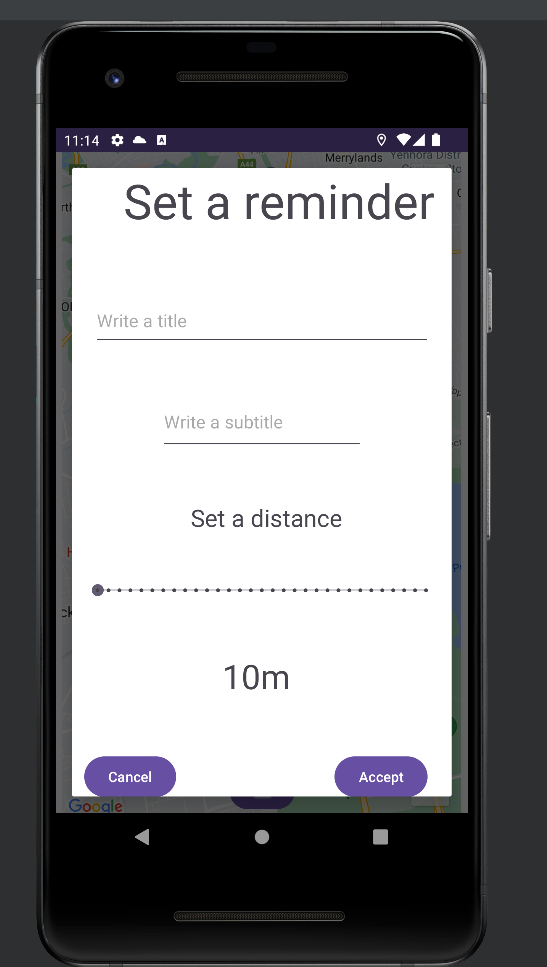
> 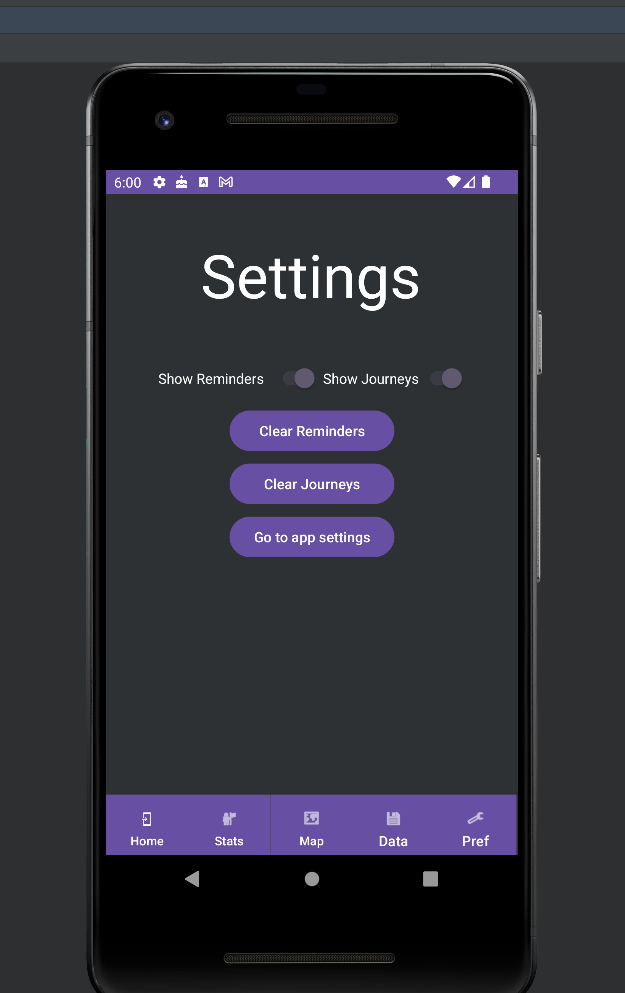

---

## Own time 

## [PadPointMouse](https://github.com/Barnold8/PadPointMouse) 

This program aims to achieve perfect comfort with ones PC. Imagine it, you're sat there laying in bed and then youtube says "Are you still watching?". And then you have to get up from that illustrious comfort you had. Or you finished a netflix movie and you dont want to get up to put another one on. Okay, I admit, this is just facilitating laziness but who doesn't want that.

PadPointMouse takes your Xbox controller and turns it into your go to place for all your basic PC needs to keep you tucked in bed or sat on the couch to chill out and enjoy your day.

This is done using the [Windows API](https://learn.microsoft.com/en-us/windows/win32/api/winbase/) (to simulate user input) and the [XInput API](https://learn.microsoft.com/en-us/windows/win32/xinput/getting-started-with-xinput) to read controller data streams. The .ini file format was also user to store user configurations. 

## [Pic2SpreadSheet](https://github.com/Barnold8/Pic2SpreadSheet) 

This is a very old piece of software, from my own history, where all it does is take an image and convert it to an excel spreadsheet. Each 3 cells in the spreadsheet represent a corresponding R,G,B value. This software is VERY slow. I wrote it before I ever took any algorithms class and I reckon a lot of optimisations could be made. I did this project after seeing [this video](https://www.youtube.com/watch?v=UBX2QQHlQ_I) by [Matt Parker](https://en.wikipedia.org/wiki/Matt_Parker) of [Numberphile](https://www.youtube.com/@numberphile) fame.

## [TwitX](https://github.com/Barnold8/TwitX) 

This is a chrome extension I made to revert parts of "X" back to twitter and also add comfort features to make the experience of modern twitter as nice as possible while keeping it the way it was before the big change. This extension no longer works as intended and you can see why in the ***Note*** section below.

### Note:
This is now deprecated/doesnt work. Twitter/X constantly updates their site to stop things like TwitX from fixing their site. I ran out of free time due to University so I lagged behind. However a great repo called [control panel for twitter](https://github.com/insin/control-panel-for-twitter/) exists which does the same and even MORE than what TwitX does, so you should check that out. 

## [YTS](https://github.com/Barnold8/YTS) 

This is a [chrome extension](https://en.wikipedia.org/wiki/Browser_extension) that aims to make playlists on youtube better. While its not fully complete in any form, it still achieves it's main goal. This will take an existing queue of videos that a user has taken and sort them accordingly. Long are the days that you have to sit there sorting videos by hand to get the shortest ones first and the longer ones last, you can now just click a button and be done for the day. This extension intercepts the autoplay feature of youtube queues and starts the next video in it's own queue rather than the predefined one stored on YouTube. The resulting visual of this is your sorted queue as to avoid any confusion. So you have your queue stored locally and showing on the YouTube website!

#### Example Images
> 
 
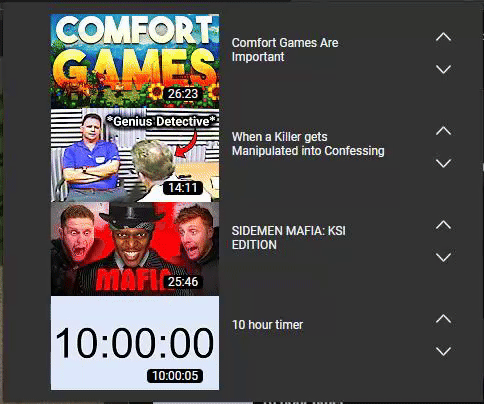

## [Garys Shop](https://github.com/Barnold8/Garys-Shop) 

This is a [chrome extension](https://en.wikipedia.org/wiki/Browser_extension) that takes all user subscribed mods on a steam collections page and adds those mods to a collection. This extension is pretty much useless since steam has implemented this on their application and I assume it is also a feature on their website. 

### Note:
Valve has finally added a feature to collections to add all subscribed items to a collection, yay! This is an alternative to steams system, which seems to do the exact same as Garys shop. This works in the browser as a [chrome extension](https://en.wikipedia.org/wiki/Browser_extension). 

## [Steam Game Comparitor](https://github.com/Barnold8/SteamGameComparitor) 

A common trend for these things I make. The Steam Game Comparitor is a python script that now has no use since Valve has added this feature to their application. This script takes any amount of user IDs and uses the [Steam API](https://steamcommunity.com/dev) to check what games all the users have in common. 

### Note:
Much like Garys Shop, Valve has added this feature to their steam software making this software depricated now.  

## [Job Finder API](https://github.com/Barnold8/JobFinderAPI) 

This is a [RESTful API](https://en.wikipedia.org/wiki/REST) in [FLASK](https://flask.palletsprojects.com/en/3.0.x/) that searches the internets top websites for jobs given some information passed to it. The input parameters for this API are "what", "where" and "pages".

- What
    - This parameter focuses on the type of job to search for
- Where 
    - This parameter focuses on the location that the job should be
- Pages 
    - This parameter dictates the amount of pages the API will scrape off of the top job websites for job roles

This [API](https://en.wikipedia.org/wiki/API) was made to make the job hunting process more streamlined and easy to implement a frontend for. Giving developers the opportunity to provide a mini Job search engine for the masses. 

## [Battery Viewer](https://github.com/Barnold8/BatteryViewer) 

This project was just a simple linux program I wrote when I was using Arch Linux on my laptop at University. I hadnt configured a GUI component to show my battery percentage so I just read the file in Linux that stores battery percentage and then just displayed that with some basic [ASCII art](https://en.wikipedia.org/wiki/ASCII_art) on the terminal.

## [Cain's Voyage](https://github.com/Barnold8/Cains-voyage) 

Cain's voyage is the only game mod I have made, and it was a fun adventure! The simple premise is that your health is tied to your coin amount in game. However, due to my lack of overall knowledge about the game, this was already a thing for a character in game and it didnt have as many bugs as my mod had. However, it was a fun experience writing [Lua](https://lua.org/) code to interface with a game and create a mod for it. 

> 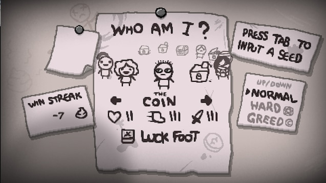

## [Terminar](https://github.com/Barnold8/Terminar) 

Terminar is python script that grabs your University Of Nottingham calendar information for the current day and displays it to the terminal. This worked the last time I used it but if the University changes their scheme to show calendar information, it will no longer work. 

## [ImageToAscii](https://github.com/Barnold8/ImageToAscii) 

This was a simple C++ program I made during a bout of boredom. This does what It says on the tin. It takes an image and generates an ASCII art representation of that image.

## [CMD_CLOCK](https://github.com/Barnold8/CMD_CLOCK) 

CMD_CLOCK was a program I made to fix a similar problem I had when it came to my battery percentage, I hadn't configured it when I had Arch Linux. So what did I do? I just made a program to tell me the time in the terminal.
